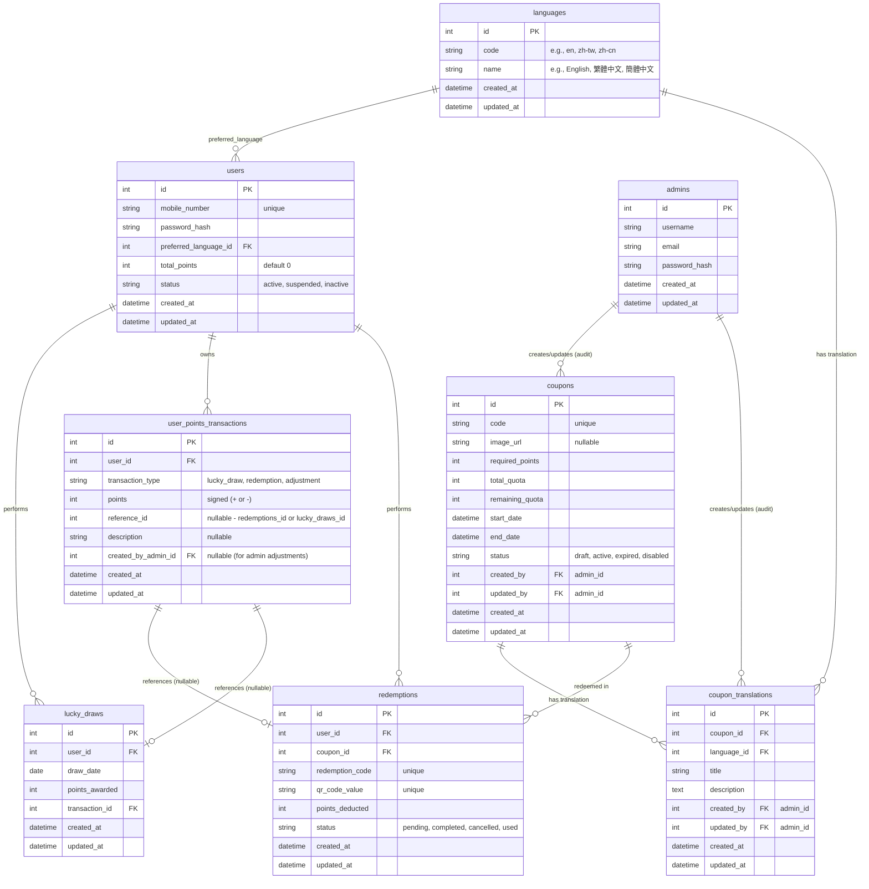

# Redemption Campaign System - Technical Assessment & Architecture Design

This document details the backend architecture design, database schema, API specifications, and scalability strategies for the Redemption Campaign System.

---

## 1. System Assumptions & Core Decisions

To ensure a robust, high-performance, and secure implementation, the following design decisions and assumptions have been made:

1. **Authentication**: All endpoints under `/api/lucky-draw`, `/api/coupons/{id}/redeem`, `/api/redemptions`, and `/api/admin` require JWT (JSON Web Token) authentication. The user's JWT contains their ID, roles, and preferred language.
2. **Timezones**: All database timestamps (`created_at`, `updated_at`, `start_date`, `end_date`) are stored in UTC. The backend handles local time translations based on the user's region or system defaults.
3. **Point Transactions**: To prevent race conditions and ensure complete traceability, points are never directly modified without an accompanying record in the `user_points_transactions` ledger table. A database transaction wraps the user balance update and the transaction log insertion.
4. **Concurrency & Race Conditions**: Coupon redemptions are subject to high concurrency. We utilize MySQL row-level locking (`SELECT ... FOR UPDATE`) or optimistic lock versioning, combined with Redis-based distributed locks to prevent coupon over-allocation.
5. **QR Code Value Format**: Generated as `RED-{YYYYMMDD}-{RANDOM_12_ALPHANUMERIC}`. E.g., `RED-20260612-A1B2C3D4E5F6`. This is globally unique and indexed.
6. **Localization**: Coupon localized text (Title, Description) resides in `coupon_translations` keyed by language ID or ISO code.

---

## 2. Entity Relationship Diagram (ERD)

Below is the Mermaid ERD representing the database structure.



---

## 3. Database Schema (MySQL DDL)

Here is the detailed SQL structure for a Laravel/MySQL setup.

```sql
-- 1. Languages Table
CREATE TABLE `languages` (
    `id` INT UNSIGNED AUTO_INCREMENT PRIMARY KEY,
    `code` VARCHAR(10) NOT NULL UNIQUE, -- 'en', 'zh-tw', 'zh-cn'
    `name` VARCHAR(50) NOT NULL,        -- 'English', '繁體中文', '簡體中文'
    `created_at` TIMESTAMP DEFAULT CURRENT_TIMESTAMP,
    `updated_at` TIMESTAMP DEFAULT CURRENT_TIMESTAMP ON UPDATE CURRENT_TIMESTAMP
) ENGINE=InnoDB DEFAULT CHARSET=utf8mb4 COLLATE=utf8mb4_unicode_ci;

-- 2. Admins Table (CMS Users)
CREATE TABLE `admins` (
    `id` INT UNSIGNED AUTO_INCREMENT PRIMARY KEY,
    `username` VARCHAR(50) NOT NULL UNIQUE,
    `email` VARCHAR(100) NOT NULL UNIQUE,
    `password_hash` VARCHAR(255) NOT NULL,
    `created_at` TIMESTAMP DEFAULT CURRENT_TIMESTAMP,
    `updated_at` TIMESTAMP DEFAULT CURRENT_TIMESTAMP ON UPDATE CURRENT_TIMESTAMP
) ENGINE=InnoDB DEFAULT CHARSET=utf8mb4 COLLATE=utf8mb4_unicode_ci;

-- 3. Users Table
CREATE TABLE `users` (
    `id` INT UNSIGNED AUTO_INCREMENT PRIMARY KEY,
    `mobile_number` VARCHAR(20) NOT NULL UNIQUE,
    `password_hash` VARCHAR(255) NOT NULL,
    `preferred_language_id` INT UNSIGNED NOT NULL,
    `total_points` INT NOT NULL DEFAULT 0,
    `status` ENUM('active', 'suspended', 'inactive') NOT NULL DEFAULT 'active',
    `created_at` TIMESTAMP DEFAULT CURRENT_TIMESTAMP,
    `updated_at` TIMESTAMP DEFAULT CURRENT_TIMESTAMP ON UPDATE CURRENT_TIMESTAMP,
    FOREIGN KEY (`preferred_language_id`) REFERENCES `languages` (`id`) ON DELETE RESTRICT
) ENGINE=InnoDB DEFAULT CHARSET=utf8mb4 COLLATE=utf8mb4_unicode_ci;

-- Indexing for user authentication and points lookup
CREATE INDEX idx_users_mobile ON `users` (`mobile_number`);
CREATE INDEX idx_users_status ON `users` (`status`);

-- 4. Coupons Table (Master)
CREATE TABLE `coupons` (
    `id` INT UNSIGNED AUTO_INCREMENT PRIMARY KEY,
    `code` VARCHAR(50) NOT NULL UNIQUE,
    `image_url` VARCHAR(255) NULL,
    `required_points` INT UNSIGNED NOT NULL,
    `total_quota` INT UNSIGNED NOT NULL,
    `remaining_quota` INT UNSIGNED NOT NULL,
    `start_date` DATETIME NOT NULL,
    `end_date` DATETIME NOT NULL,
    `status` ENUM('draft', 'active', 'expired', 'disabled') NOT NULL DEFAULT 'draft',
    `created_by` INT UNSIGNED NOT NULL,
    `updated_by` INT UNSIGNED NOT NULL,
    `created_at` TIMESTAMP DEFAULT CURRENT_TIMESTAMP,
    `updated_at` TIMESTAMP DEFAULT CURRENT_TIMESTAMP ON UPDATE CURRENT_TIMESTAMP,
    FOREIGN KEY (`created_by`) REFERENCES `admins` (`id`) ON DELETE RESTRICT,
    FOREIGN KEY (`updated_by`) REFERENCES `admins` (`id`) ON DELETE RESTRICT
) ENGINE=InnoDB DEFAULT CHARSET=utf8mb4 COLLATE=utf8mb4_unicode_ci;

-- Indexes for listings and scheduling
CREATE INDEX idx_coupons_status_dates ON `coupons` (`status`, `start_date`, `end_date`);
CREATE INDEX idx_coupons_code ON `coupons` (`code`);

-- 5. Coupon Translations Table
CREATE TABLE `coupon_translations` (
    `id` INT UNSIGNED AUTO_INCREMENT PRIMARY KEY,
    `coupon_id` INT UNSIGNED NOT NULL,
    `language_id` INT UNSIGNED NOT NULL,
    `title` VARCHAR(255) NOT NULL,
    `description` TEXT NOT NULL,
    `created_by` INT UNSIGNED NOT NULL,
    `updated_by` INT UNSIGNED NOT NULL,
    `created_at` TIMESTAMP DEFAULT CURRENT_TIMESTAMP,
    `updated_at` TIMESTAMP DEFAULT CURRENT_TIMESTAMP ON UPDATE CURRENT_TIMESTAMP,
    UNIQUE KEY `unique_coupon_language` (`coupon_id`, `language_id`),
    FOREIGN KEY (`coupon_id`) REFERENCES `coupons` (`id`) ON DELETE CASCADE,
    FOREIGN KEY (`language_id`) REFERENCES `languages` (`id`) ON DELETE RESTRICT,
    FOREIGN KEY (`created_by`) REFERENCES `admins` (`id`) ON DELETE RESTRICT,
    FOREIGN KEY (`updated_by`) REFERENCES `admins` (`id`) ON DELETE RESTRICT
) ENGINE=InnoDB DEFAULT CHARSET=utf8mb4 COLLATE=utf8mb4_unicode_ci;

-- 6. Redemptions Table
CREATE TABLE `redemptions` (
    `id` INT UNSIGNED AUTO_INCREMENT PRIMARY KEY,
    `user_id` INT UNSIGNED NOT NULL,
    `coupon_id` INT UNSIGNED NOT NULL,
    `redemption_code` VARCHAR(50) NOT NULL UNIQUE,
    `qr_code_value` VARCHAR(100) NOT NULL UNIQUE,
    `points_deducted` INT UNSIGNED NOT NULL,
    `status` ENUM('pending', 'completed', 'cancelled', 'used') NOT NULL DEFAULT 'completed',
    `created_at` TIMESTAMP DEFAULT CURRENT_TIMESTAMP,
    `updated_at` TIMESTAMP DEFAULT CURRENT_TIMESTAMP ON UPDATE CURRENT_TIMESTAMP,
    FOREIGN KEY (`user_id`) REFERENCES `users` (`id`) ON DELETE RESTRICT,
    FOREIGN KEY (`coupon_id`) REFERENCES `coupons` (`id`) ON DELETE RESTRICT
) ENGINE=InnoDB DEFAULT CHARSET=utf8mb4 COLLATE=utf8mb4_unicode_ci;

CREATE INDEX idx_redemptions_user ON `redemptions` (`user_id`);
CREATE INDEX idx_redemptions_coupon ON `redemptions` (`coupon_id`);
CREATE INDEX idx_redemptions_code ON `redemptions` (`redemption_code`);

-- 7. Lucky Draws Table
CREATE TABLE `lucky_draws` (
    `id` INT UNSIGNED AUTO_INCREMENT PRIMARY KEY,
    `user_id` INT UNSIGNED NOT NULL,
    `draw_date` DATE NOT NULL,
    `points_awarded` INT UNSIGNED NOT NULL,
    `created_at` TIMESTAMP DEFAULT CURRENT_TIMESTAMP,
    `updated_at` TIMESTAMP DEFAULT CURRENT_TIMESTAMP ON UPDATE CURRENT_TIMESTAMP,
    UNIQUE KEY `unique_user_daily_draw` (`user_id`, `draw_date`),
    FOREIGN KEY (`user_id`) REFERENCES `users` (`id`) ON DELETE RESTRICT
) ENGINE=InnoDB DEFAULT CHARSET=utf8mb4 COLLATE=utf8mb4_unicode_ci;

CREATE INDEX idx_lucky_draws_user_date ON `lucky_draws` (`user_id`, `draw_date`);

-- 8. User Points Transactions Table (Auditable ledger)
CREATE TABLE `user_points_transactions` (
    `id` INT UNSIGNED AUTO_INCREMENT PRIMARY KEY,
    `user_id` INT UNSIGNED NOT NULL,
    `transaction_type` ENUM('lucky_draw', 'redemption', 'adjustment') NOT NULL,
    `points` INT NOT NULL, -- positive for credit, negative for debit
    `reference_id` INT UNSIGNED NULL, -- points to redemptions.id or lucky_draws.id
    `description` VARCHAR(255) NULL,
    `created_by_admin_id` INT UNSIGNED NULL, -- populated if adjustment done via CMS
    `created_at` TIMESTAMP DEFAULT CURRENT_TIMESTAMP,
    `updated_at` TIMESTAMP DEFAULT CURRENT_TIMESTAMP ON UPDATE CURRENT_TIMESTAMP,
    FOREIGN KEY (`user_id`) REFERENCES `users` (`id`) ON DELETE RESTRICT,
    FOREIGN KEY (`created_by_admin_id`) REFERENCES `admins` (`id`) ON DELETE RESTRICT
) ENGINE=InnoDB DEFAULT CHARSET=utf8mb4 COLLATE=utf8mb4_unicode_ci;

CREATE INDEX idx_user_points_transactions_user ON `user_points_transactions` (`user_id`);
```

---

## 4. API Design Specifications

All requests should supply `Accept: application/json` headers. Authenticated API endpoints require `Authorization: Bearer <JWT_TOKEN>`.

### 4.1 Authentication APIs

#### Register
* **Endpoint**: `POST /api/register`
* **Validation Rules**:
  * `mobile_number`: `required|string|regex:/^[0-9+]+$/|unique:users,mobile_number`
  * `password`: `required|string|min:8|confirmed`
  * `preferred_language`: `required|string|exists:languages,code`
* **Request Sample**:
  ```json
  {
    "mobile_number": "+85291234567",
    "password": "Password123!",
    "password_confirmation": "Password123!",
    "preferred_language": "zh-tw"
  }
  ```
* **Success Response** (`201 Created`):
  ```json
  {
    "success": true,
    "message": "User registered successfully",
    "data": {
      "user_id": 42,
      "mobile_number": "+85291234567",
      "preferred_language": "zh-tw",
      "total_points": 0
    }
  }
  ```
* **Error Response** (`422 Unprocessable Entity`):
  ```json
  {
    "success": false,
    "message": "Validation failed",
    "errors": {
      "mobile_number": ["The mobile number has already been taken."],
      "password": ["The password confirmation does not match."]
    }
  }
  ```

#### Login
* **Endpoint**: `POST /api/login`
* **Validation Rules**:
  * `mobile_number`: `required|string`
  * `password`: `required|string`
* **Request Sample**:
  ```json
  {
    "mobile_number": "+85291234567",
    "password": "Password123!"
  }
  ```
* **Success Response** (`200 OK`):
  ```json
  {
    "success": true,
    "token": "eyJhbGciOiJIUzI1NiIsInR5cCI6IkpXVCJ9...",
    "expires_in": 3600,
    "user": {
      "id": 42,
      "mobile_number": "+85291234567",
      "preferred_language": "zh-tw",
      "total_points": 250
    }
  }
  ```
* **Error Response** (`401 Unauthorized`):
  ```json
  {
    "success": false,
    "message": "Invalid credentials"
  }
  ```

#### Profile
* **Endpoint**: `GET /api/profile`
* **Headers**: `Authorization: Bearer <token>`
* **Success Response** (`200 OK`):
  ```json
  {
    "success": true,
    "data": {
      "id": 42,
      "mobile_number": "+85291234567",
      "preferred_language": "zh-tw",
      "total_points": 250,
      "status": "active",
      "created_at": "2026-06-12T02:00:00Z"
    }
  }
  ```

---

### 4.2 Lucky Draw APIs

#### Daily Draw
* **Endpoint**: `POST /api/lucky-draw`
* **Headers**: `Authorization: Bearer <token>`
* **Business Logic & Validation**:
  * The API checks if a record exists in `lucky_draws` for this `user_id` and the current date (in user's timezone context or UTC date boundary as aligned).
  * If a record exists, return a `400 Bad Request` or `422 Unprocessable Entity` error.
* **Success Response** (`200 OK`):
  ```json
  {
    "success": true,
    "message": "Draw completed successfully",
    "data": {
      "awarded_points": 50,
      "current_balance": 300
    }
  }
  ```
* **Error Response** (`422 Unprocessable Entity`):
  ```json
  {
    "success": false,
    "message": "You have already participated in today's lucky draw."
  }
  ```

#### Draw History
* **Endpoint**: `GET /api/lucky-draw/history`
* **Headers**: `Authorization: Bearer <token>`
* **Query Params**: `page` (int, default 1), `per_page` (int, default 15)
* **Success Response** (`200 OK`):
  ```json
  {
    "success": true,
    "data": [
      {
        "id": 105,
        "draw_date": "2026-06-12",
        "points_awarded": 50,
        "created_at": "2026-06-12T03:15:30Z"
      },
      {
        "id": 88,
        "draw_date": "2026-06-11",
        "points_awarded": 20,
        "created_at": "2026-06-11T08:22:11Z"
      }
    ],
    "meta": {
      "current_page": 1,
      "last_page": 2,
      "per_page": 15,
      "total": 17
    }
  }
  ```

---

### 4.3 Coupon APIs (User-facing)

#### Coupon List
* **Endpoint**: `GET /api/coupons`
* **Headers**: `Authorization: Bearer <token>` (Optional or Required, depending on configuration. If present, filter "Redeemable" using the user's actual points balance)
* **Parameters**:
  * `language` (string, optional, e.g. `en`, `zh-tw`, `zh-cn`. If omitted, fallback to preferred_language from profile or default system language)
  * `filter` (string, optional: `all`, `redeemable` [points >= required], `available` [quota > 0], `expired` [end_date < now])
  * `page` (int, default 1)
  * `per_page` (int, default 10)
* **Success Response** (`200 OK`):
  ```json
  {
    "success": true,
    "data": [
      {
        "id": 12,
        "code": "COUPON-STARBUCKS-50",
        "title": "Starbucks HK$50 Cash Voucher",
        "description": "Get HK$50 off upon purchases at any Starbucks local stores.",
        "image_url": "https://cdn.example.com/coupons/sb50.png",
        "required_points": 500,
        "remaining_quota": 85,
        "expiry_date": "2026-12-31T23:59:59Z",
        "is_redeemable": false
      }
    ],
    "meta": {
      "current_page": 1,
      "last_page": 5,
      "per_page": 10,
      "total": 48
    }
  }
  ```

#### Coupon Details
* **Endpoint**: `GET /api/coupons/{id}`
* **Parameters**: `language` (string, optional)
* **Success Response** (`200 OK`):
  ```json
  {
    "success": true,
    "data": {
      "id": 12,
      "code": "COUPON-STARBUCKS-50",
      "title": "Starbucks HK$50 Cash Voucher",
      "description": "Get HK$50 off upon purchases at any Starbucks local stores.",
      "image_url": "https://cdn.example.com/coupons/sb50.png",
      "required_points": 500,
      "total_quota": 1000,
      "remaining_quota": 85,
      "start_date": "2026-06-01T00:00:00Z",
      "expiry_date": "2026-12-31T23:59:59Z",
      "status": "active"
    }
  }
  ```

---

### 4.4 Redemption APIs

#### Redeem Coupon
* **Endpoint**: `POST /api/coupons/{id}/redeem`
* **Headers**: `Authorization: Bearer <token>`
* **Success Response** (`201 Created`):
  ```json
  {
    "success": true,
    "message": "Coupon redeemed successfully",
    "data": {
      "redemption_id": 502,
      "redemption_code": "RED-20260612-A1B2C3D4E5F6",
      "qr_code_value": "RED-20260612-A1B2C3D4E5F6",
      "points_deducted": 500,
      "remaining_points": 250
    }
  }
  ```
* **Error Response** (e.g. `400 Bad Request` or `422 Unprocessable Entity`):
  ```json
  {
    "success": false,
    "message": "Redemption failed",
    "errors": {
      "points": ["Insufficient points balance."],
      "quota": ["Coupon quota has been fully redeemed."]
    }
  }
  ```

#### Redemption History
* **Endpoint**: `GET /api/redemptions`
* **Headers**: `Authorization: Bearer <token>`
* **Query Params**: `page`, `per_page`
* **Success Response** (`200 OK`):
  ```json
  {
    "success": true,
    "data": [
      {
        "id": 502,
        "redemption_code": "RED-20260612-A1B2C3D4E5F6",
        "qr_code_value": "RED-20260612-A1B2C3D4E5F6",
        "coupon": {
          "id": 12,
          "title": "Starbucks HK$50 Cash Voucher"
        },
        "points_deducted": 500,
        "status": "completed",
        "created_at": "2026-06-12T04:12:00Z"
      }
    ],
    "meta": {
      "current_page": 1,
      "last_page": 1,
      "per_page": 15,
      "total": 1
    }
  }
  ```

#### Redemption Details
* **Endpoint**: `GET /api/redemptions/{id}`
* **Headers**: `Authorization: Bearer <token>`
* **Success Response** (`200 OK`):
  ```json
  {
    "success": true,
    "data": {
      "id": 502,
      "redemption_code": "RED-20260612-A1B2C3D4E5F6",
      "qr_code_value": "RED-20260612-A1B2C3D4E5F6",
      "coupon": {
        "id": 12,
        "code": "COUPON-STARBUCKS-50",
        "title": "Starbucks HK$50 Cash Voucher",
        "description": "Get HK$50 off upon purchases at any Starbucks local stores.",
        "image_url": "https://cdn.example.com/coupons/sb50.png"
      },
      "points_deducted": 500,
      "status": "completed",
      "created_at": "2026-06-12T04:12:00Z"
    }
  }
  ```

---

### 4.5 CMS / Admin APIs

All Admin APIs require an admin JWT validation and verify permissions.

#### Create Coupon
* **Endpoint**: `POST /api/admin/coupons`
* **Headers**: `Authorization: Bearer <admin_token>`
* **Validation Rules**:
  * `code`: `required|string|max:50|unique:coupons,code`
  * `required_points`: `required|integer|min:0`
  * `total_quota`: `required|integer|min:1`
  * `start_date`: `required|date|after_or_equal:today`
  * `end_date`: `required|date|after:start_date`
  * `status`: `required|in:draft,active,expired,disabled`
  * `translations`: `required|array|min:1`
  * `translations.*.language_code`: `required|string|exists:languages,code`
  * `translations.*.title`: `required|string|max:255`
  * `translations.*.description`: `required|string`
* **Request Sample**:
  ```json
  {
    "code": "COUPON-STARBUCKS-50",
    "image_url": "https://cdn.example.com/coupons/sb50.png",
    "required_points": 500,
    "total_quota": 1000,
    "start_date": "2026-06-12T00:00:00Z",
    "end_date": "2026-12-31T23:59:59Z",
    "status": "active",
    "translations": [
      {
        "language_code": "en",
        "title": "Starbucks HK$50 Cash Voucher",
        "description": "Get HK$50 off at Starbucks."
      },
      {
        "language_code": "zh-tw",
        "title": "星巴克 HK$50 現金券",
        "description": "於星巴克門市消費可減免 HK$50。"
      }
    ]
  }
  ```
* **Success Response** (`201 Created`):
  ```json
  {
    "success": true,
    "message": "Coupon created successfully",
    "coupon_id": 12
  }
  ```

#### Update Coupon
* **Endpoint**: `PUT /api/admin/coupons/{id}`
* **Headers**: `Authorization: Bearer <admin_token>`
* **Validation Rules**:
  * `required_points`: `sometimes|integer|min:0`
  * `total_quota`: `sometimes|integer|min:1` (must not be less than existing redemptions count)
  * `status`: `sometimes|in:draft,active,expired,disabled`
  * `translations`: `sometimes|array`
* **Success Response** (`200 OK`):
  ```json
  {
    "success": true,
    "message": "Coupon updated successfully"
  }
  ```

#### Coupon List (CMS View)
* **Endpoint**: `GET /api/admin/coupons`
* **Headers**: `Authorization: Bearer <admin_token>`
* **Query Params**: `page`, `per_page`, `status`, `search`
* **Success Response** (`200 OK`):
  ```json
  {
    "success": true,
    "data": [
      {
        "id": 12,
        "code": "COUPON-STARBUCKS-50",
        "required_points": 500,
        "total_quota": 1000,
        "remaining_quota": 85,
        "status": "active",
        "start_date": "2026-06-12T00:00:00Z",
        "end_date": "2026-12-31T23:59:59Z",
        "translations": {
          "en": "Starbucks HK$50 Cash Voucher",
          "zh-tw": "星巴克 HK$50 現金券"
        }
      }
    ]
  }
  ```

#### Redemption Report
* **Endpoint**: `GET /api/admin/redemptions`
* **Headers**: `Authorization: Bearer <admin_token>`
* **Query Params**: `start_date`, `end_date`, `coupon_id`, `mobile_number`, `page`, `per_page`
* **Success Response** (`200 OK`):
  ```json
  {
    "success": true,
    "data": [
      {
        "redemption_id": 502,
        "redemption_code": "RED-20260612-A1B2C3D4E5F6",
        "user": {
          "id": 42,
          "mobile_number": "+85291234567"
        },
        "coupon": {
          "id": 12,
          "code": "COUPON-STARBUCKS-50",
          "title_en": "Starbucks HK$50 Cash Voucher"
        },
        "points_deducted": 500,
        "status": "completed",
        "created_at": "2026-06-12T04:12:00Z"
      }
    ]
  }
  ```

---

## 5. Critical Technical Workflows & Validation Logic

### 5.1 Registration Validation
- Verify the mobile number is unique across `users`.
- Hash passwords using **bcrypt** or **argon2id** with high work factors.
- Associate the corresponding `languages.id` based on user preference.

### 5.2 Daily Lucky Draw Flow
To guarantee a user only draws once per day under high load:
1. Define a database unique constraint on `lucky_draws` table: `UNIQUE KEY unique_user_daily_draw (user_id, draw_date)`.
2. Compute `draw_date` based on the system's timezone configurations (typically UTC or specific timezone aligned for daily reset).
3. Draw Logic:
   * Generate random points from target distribution array (e.g., `[10, 20, 50, 100]` with weight distributions).
   * Inside a Database Transaction:
     1. Insert a record in `lucky_draws`. If it throws a duplicate entry key exception, rollback and return a `422` validation error.
     2. Update the user's `total_points` using:
        ```sql
        UPDATE users SET total_points = total_points + :awarded_points WHERE id = :user_id;
        ```
     3. Insert a log into `user_points_transactions` recording the balance change.
     4. Commit Transaction.

### 5.3 Coupon Redemption Concurrency & Race Condition Prevention
To prevent "double-spending" of points or exceeding the coupon quota, we use a structured lock.

#### Method A: Database Row-Level Locking (Pessimistic)
Inside a Database Transaction:
1. Lock and retrieve the user record:
   ```sql
   SELECT total_points FROM users WHERE id = :user_id FOR UPDATE;
   ```
2. Lock and retrieve the coupon record:
   ```sql
   SELECT remaining_quota, required_points, status, start_date, end_date FROM coupons WHERE id = :coupon_id FOR UPDATE;
   ```
3. Perform validation:
   * Verify Coupon Status is `active`.
   * Verify Current time is between `start_date` and `end_date`.
   * Verify `remaining_quota` > 0.
   * Verify User `total_points` >= Coupon `required_points`.
4. Deduct User Points:
   ```sql
   UPDATE users SET total_points = total_points - :required_points WHERE id = :user_id;
   ```
5. Deduct Coupon Quota:
   ```sql
   UPDATE coupons SET remaining_quota = remaining_quota - 1 WHERE id = :coupon_id;
   ```
6. Generate unique values and insert to `redemptions`.
7. Write audit record in `user_points_transactions` with negative points value.
8. Commit Transaction.

#### Method B: Distributed Locks (Redis-based for High Concurrency)
For high-traffic events:
1. Acquire a Redis lock on key: `lock:coupon:redemption:{coupon_id}`.
2. If failed, return retry message or queue.
3. Validate and decrement coupon quota directly in Redis key: `coupon:quota:{coupon_id}` using `DECRBY`. If value drops below 0, increment back and return "Fully Redeemed".
4. Execute DB points deduction under Transaction.
5. Release Redis lock.

---

## 6. Scalability, Security & Future Enhancements

### 6.1 Database Optimization
- **Partitioning**: If transaction volume grows large (e.g., tens of millions of point history rows), partition `user_points_transactions` by range of `created_at` (monthly partitions).
- **Read/Write Splitting**: Route read operations (coupon list, history) to read-replicas, while directing write actions (daily draw, redemption) to the master database.

### 6.2 Caching Strategy
- Cache coupon master details and translations in Redis with an eviction policy triggered when admins update coupons.
- Cache user points balance to speed up check screens (always verified against DB prior to actual redemption).

### 6.3 QR Code Security
- QR Code values (`RED-20260612-A1B2C3D4E5F6`) are cryptographically random strings to prevent spoofing or sequential guessing.
- To prevent misuse, QR code values can be short-lived, or dynamically hashed with timestamps if verified in real-time at offline POS merchant systems.
- Consider utilizing Signed URLs or JWT payloads inside the QR codes for decentralized off-grid verification.
